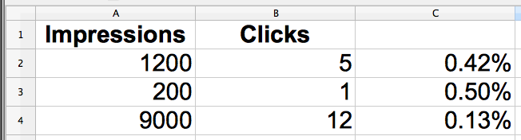

!SLIDE

    @@@ruby
    report do
      title "Simple Report"
      
      impressions = column :impressions
      clicks = column :clicks
      percentage { clicks / impressions }
    end

!SLIDE center
